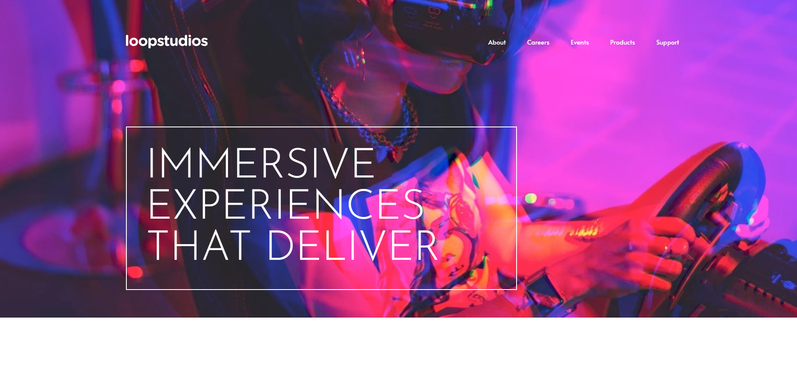
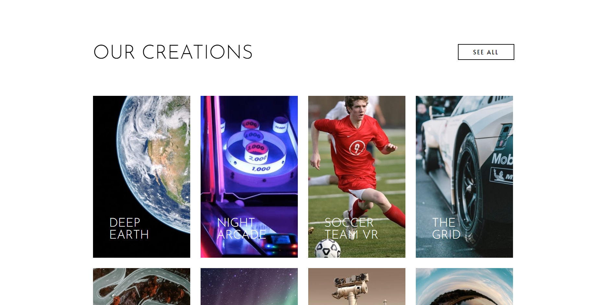

## Table of contents

- [Overview](#overview)
  - [The challenge](#the-challenge)
  - [Links](#links)
  - [Project screens](#project-screens)
- [My process](#my-process)
  - [Built with](#built-with)
- [Author](#author)

## Overview

### The challenge

Users should be able to:

- View the optimal layout for the site depending on their device's screen size.

### Links

- Solution URL: [github.com/emanuelsaucedoa/loopstudios-landing-page](https://github.com/emanuelsaucedoa/loopstudios-landing-page)
- Link URL: [loopstudios-landing-page-six-fawn.vercel.app/](https://loopstudios-landing-page-six-fawn.vercel.app/)

### Project screens

#### HEADER

#### GALLERY

## My process

### Built with

- HTML5
- CSS
- Flexbox
- Javascript

## Author

- Linkedin - [emanuelsaucedo](https://www.linkedin.com/in/emanuelsaucedo/)
- Github - [@emanuelsaucedoa](https://github.com/emanuelsaucedoa)
